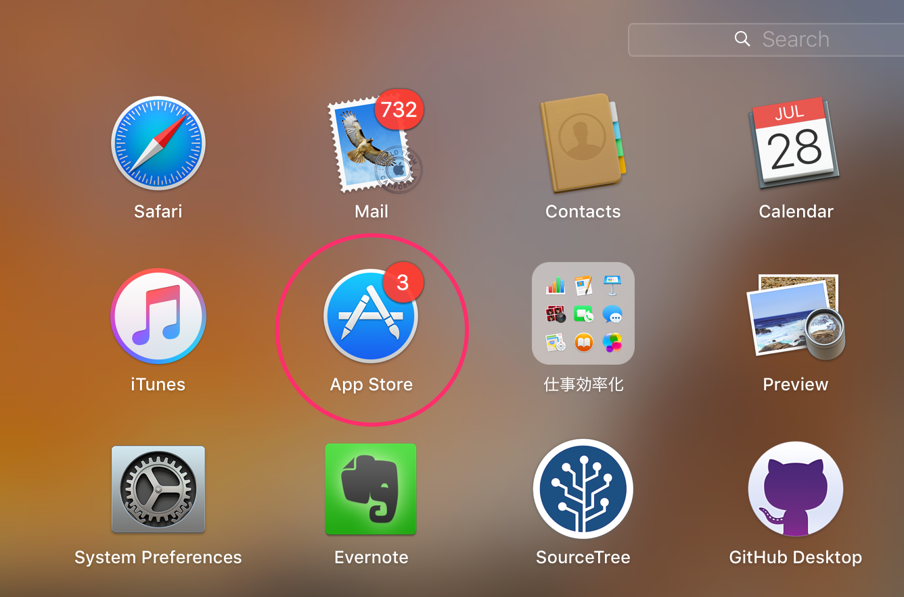

# Lesson 1. Install Xcode and create project

Step 1. `App Store`を開く。

Step 2. `Xcode`を検索して、インストールする。（3.8Gですので、🕐時間がかかります。）

Step 3. `Xcode`を開いて、新しいプロジェクトを作る。

`File -> New -> Project`， shortcut: `shift + command + N`

Step 4. `Single View Application`を選択して、`Next`をクリックする。

Step 5. `Product Name`のところで、自分好きな名前を入力して、`Next`をクリックする。

Step 6. おめでとう🎉、初めてのXcodeプロジェクトを作った。

###[➡️: Lesson 2](../Lesson_2/README.md)