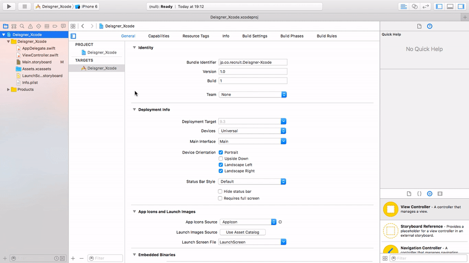
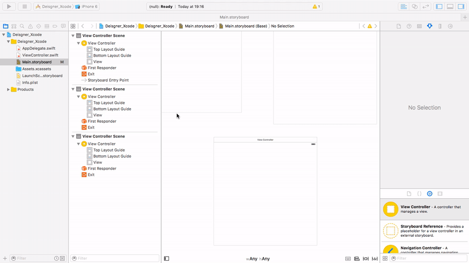
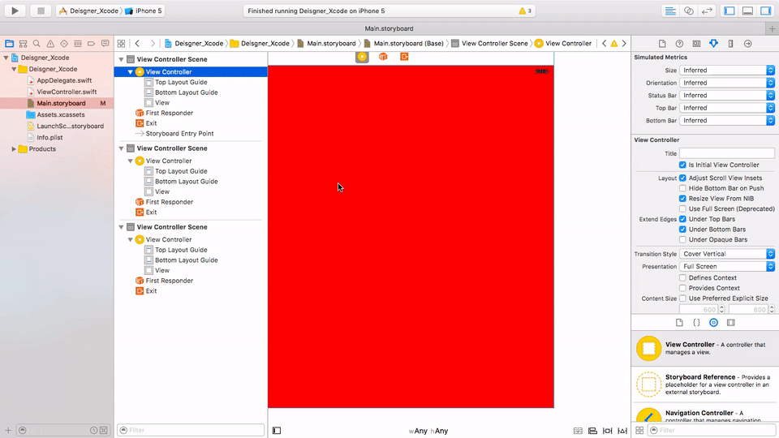

# Lesson 2. About Storyboard
###[⬅️: Lesson 1](../Lesson_1/README.md)

**Storyboardは何？**

簡単に言うと、いろいろな画面のコンテナだ。複数の画面を持つことができる。

**ViewControllerは何？**

簡単に言うと、`ViewController`は画面だ。

👇🏻以下のように、`Storyboard`の中に画面を入れよう。

**Viewは何？**

`ViewController`の中に`View`がある。`View`はPhotoshopのキャンバスようなものだ。中にパーツ配置し、また、`View`自身の背景色も変えられる。

これからの授業は主に`View`で色々操作するので、「`ViewController`の`View`はデザイナーの友達だ。」ということを覚えておこう。

**実機で画面の様子を見たい時、どうすればいい？**

Xcode左上にplayボタンようなボタンをクリックしたら、Appがビルドして、画面の様子が見える。shortcut:`⌘R`。

実機で動くのは証明書が必要だ。付近のエンジニアを聞いてください。

もし証明書がない場合、Xcode中のシミュレータを使ってください。

👇🏻以下のように、`ViewController`の`View`の背景色を変えた後、シミュレータで画面の様子をチェックしよう。

**初期画面はどうやって決める？**

`Storyboard`は複数の画面を持つことができるので、どちらの画面を表示するのは`Storyboard`中の`矢印`を決めたものだ。

👇🏻以下のように、`矢印`を移動した後、シミュレータで画面の様子をチェックしよう。

###[➡️: Lesson 3](../Lesson_3/README.md)