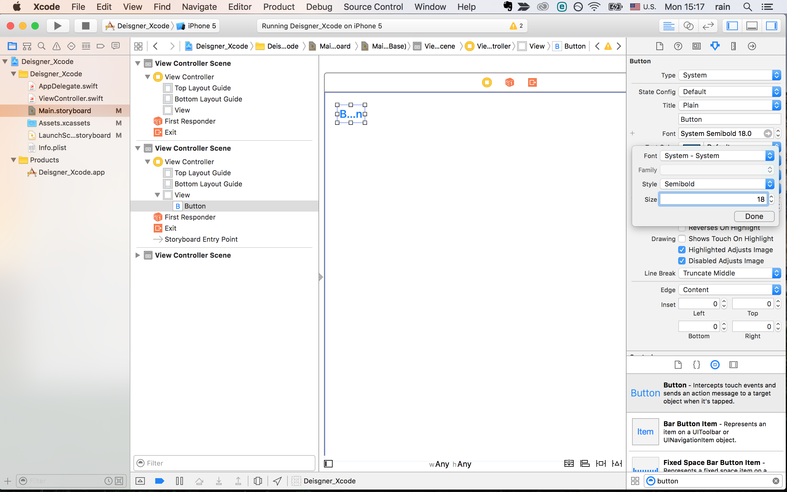
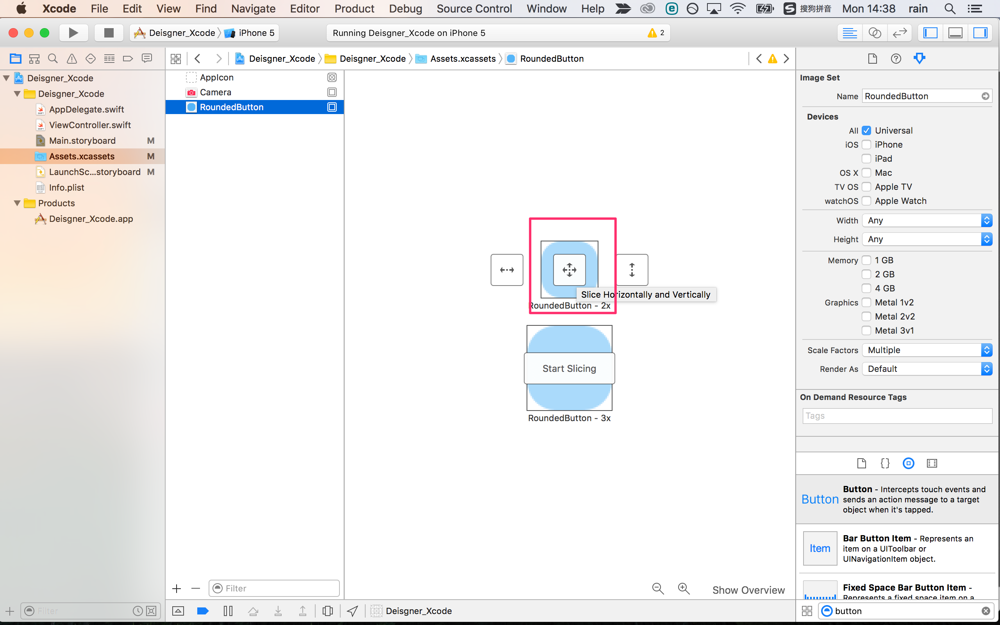
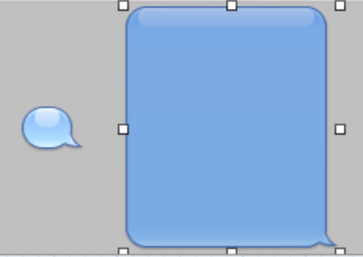

# Lesson 3. How to use UIButton

###[⬅️: Lesson 2](../Lesson_2/README.md)

概要: ボタンはよく使われるUIパーツなので、今回は`UIButton`の使い方についてのレッスンだ。

最後の成果物は以下の図ように。

Step 1. まず、[このプロジェクト](starter)をダウンロードしてください。

Step 2. Xcodeプロジェクトを開く、`Main.storyboard`のところで、矢印をついている`ViewController`の`View`を選択し、`background`色を`White Color`に変更する。

これからのレッスンは主に以下の図に示した`プロパティ調整`のところで色々操作するので、このアイコンを覚えておこう。

Step 3. 右下の検索欄で`button`を検索して、`ViewController`の`View`(キャンバス)に入れる。

Step 4. 自由に`button`を移動して、キャンバスの真ん中と角のところにPhotoshopのSmart Guidesような補助線が見える。

Step 5. `button`をキャンバスの左上に移動する。

Step 6. `button`を選択して、`Style: Semibold`, `Size: 18`に変更する。

Step 7. font size大きくなったので、`button`の枠は変になった。`Editor -> Size to Fit Content`をクリックすると、枠は適切なサイズになる。shortcut: `⌘=`

Step 8. `button`を選択して、キーボードの`option`を押したままドラッグすると、同じ`button`コピーできる。(Photoshopと同じだ。)

Step 9. アイコンがある`button`を作りたい時、以下の図に示した`Image`のところで指定する。

Step 10. 手元にあるアイコンを`Assets.xcassets`にドラッグする、例：カメラアイコン。

Step 11. `Main.storyboard`に戻って、以下図に示した`Image`のところで`Camera`を入力し、そして、`Title`ところで名前を削除する。(すでにアイコンがあるので、`Title`はいらない。)

Step 12. 以下の図に示した`Background`は`button`の背景だ。角丸のボタンを作りたい時、`Background`の出番だ。

Step 13. Photoshopで以下の図ような`width: 18 point, height: 18 point`のpngを用意する。Step 1でダウンロードした[フォルダー](starter/resources)中の画像を使ってもいい。

Step 14. `Assets.xcassets`にドラッグして、右下の`Show Slicing`をクリックする。

Step 15. `Start Slicing`をクリックする。

Step 16. 以下の図赤い枠のアイコンをクリックする。

Step 17. なぜ`Slicing`するかというと、どんなボタンサイズでも、綺麗な角丸を作るために、`変わらない部分`と`重複部分`をスライスする必要がある。このように作ったイメージは`Resizable Image`と呼ばれる。

Step 18. Xcodeは自動的画像を分析して、適切な位置でスライスしてくれるので、ほとんど調整はいらないが、もし調整したい時、以下の図に示したところで調整する。

ちなみに、iOS6以前メッセージUIのバブル部分も同じ技術だ。

Step 19. ２番目の`button`を選択し、サイズを変更する。

Step 20. `Background`のところで、先ほど`Assets.xcassets`にドラッグした角丸のpng名前を入力すると、`button`の背景が変になったが、でも、心配しないて、ビルドしたら、ちゃんと正しいようにしてくれる。

Step 21. また、`Step 7`ように、もう一つのボタンをコーピして、`Step 18`ように、`button`サイズを変更して、もう一度ビルドしたら、結果は以下の図ようになる。

Step 22. もし`Step 12`は境界線が付いているpngを用意した場合、結果は以下の図ようになる。

最後:

このレッスン最後出来上がったプロジェクトは[ここにある](final)。

###[➡️: Lesson 4](../Lesson_4/README.md)