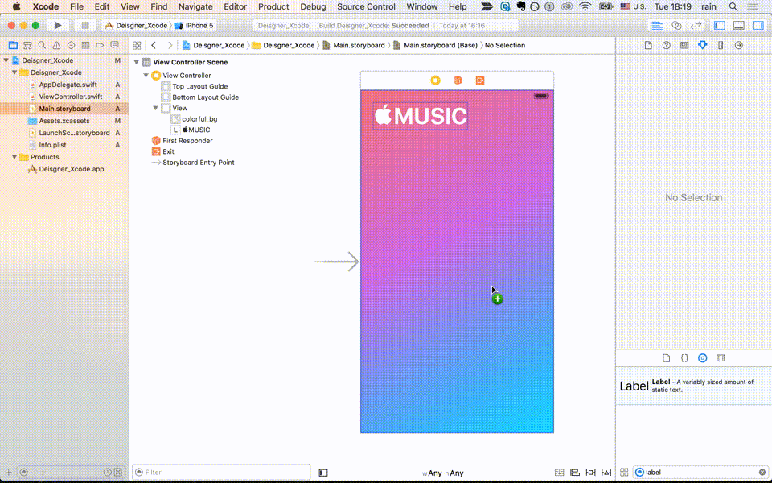

# Lesson 4. How to use UILabel, UIImageView

###[⬅️: Lesson 3](../Lesson_3/README.md)

概要: 今回は`UILabel`、`UIImageView`の使い方についてのレッスンだ。使い方だけ勉強するのは面白くないので、`UILabel`、`UIImageView`を使って、`Apple Music`のUIを作ろう。

最後の成果物は以下の図ように:

Step 1. まず、[このプロジェクト](starter)をダウンロードしてください。

Step 2. Photoshopでピンクから、紫、水色までのグラデーションイメージを作る。`Apple Music`のUIと全く同じする必要がない、適当でいい。サイズは`320 * 568`、iPhone5/5sの画面サイズ。Step 1でダウンロードした[フォルダー](starter/resources)中の画像を使ってもいい。(今回練習便利のために、iPhone5/5sつまり4-inchのデバイスを対象となる)

Step 3. グラデーションイメージを`Assets.xcassets`にドラッグした後、 `Main.storyboard`を選択し、`UIViewController`のサイズを4-inchに設定しよう。

Step 4. `UIImageView`の使い方はすごく簡単だ。

👇🏻以下のように、`UIImageView`のサイズとプロパテを設定しよう。

Step 5. `UILabel`の使い方も難しくない。

👇🏻以下のように、`UILabel`のサイズとプロパテを設定しよう。

Tips: [Lesson 3](../Lesson_3/README.md)で勉強したfont size大きくなって、`UIButton`の枠は変になった時の対応覚えているか？ 実は`UILabel`も同じ対応だ。

Hint: `⌘=`

Step 6. 👇🏻以下のように、もう一つの`UILabel`のサイズとプロパテを設定しよう。

注意点: 実は`UILabel`デフォルト表示できるのは一行だけので、複数行表示する時、`プロパティ調整` - `Lines`のところで、`1`から`0`に変更する必要がある。

Step 7. Step 6とほとんど同じだ。

👇🏻以下のように、三つ目の`UILabel`のサイズとプロパテを設定しよう。

Step 8. [Lesson 3](../Lesson_3/README.md)で勉強した角丸のボタンの作り方覚えているか？毎回画像を作って、スライスするのは面倒なので、もしPhotoshopように、自由にボタンの色と角丸の半径を設定できたらいいなぁと思うでしょう。

お任せください。便利な方法を考えた。💡

まず、👇🏻以下のように、ボタンを配置しよう。

Step 9. 以下の図に示したところで、`RoundedCornerButton`を入力する

Step 10. では、Photoshopような自由さを体験しよう。

👇🏻以下のように、ボタンの色と角丸の半径など調整しよう。

Step 11. ボタンタップした後の色を調整したい場合。

👇🏻以下のように、`Highlighted bg`のとこでで調整する。

Step 12. 最後のステップだ、もう一つのボタンを入れよう。

最後:

このレッスン最後出来上がったプロジェクトは[ここにある](final)。

###[➡️: Lesson 5](../Lesson_5/README.md)