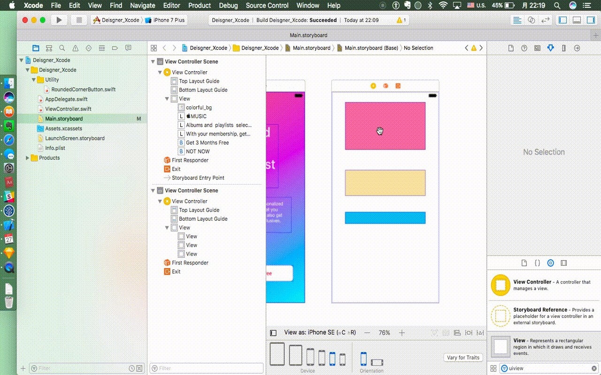
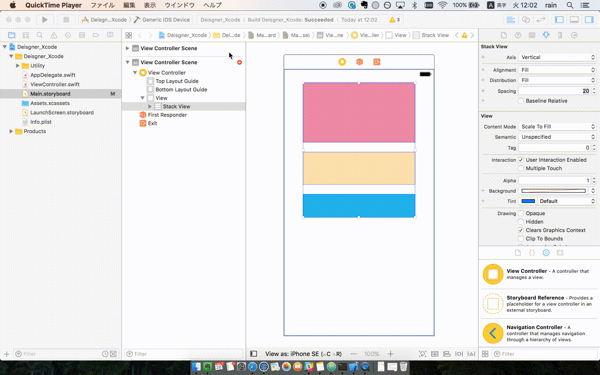
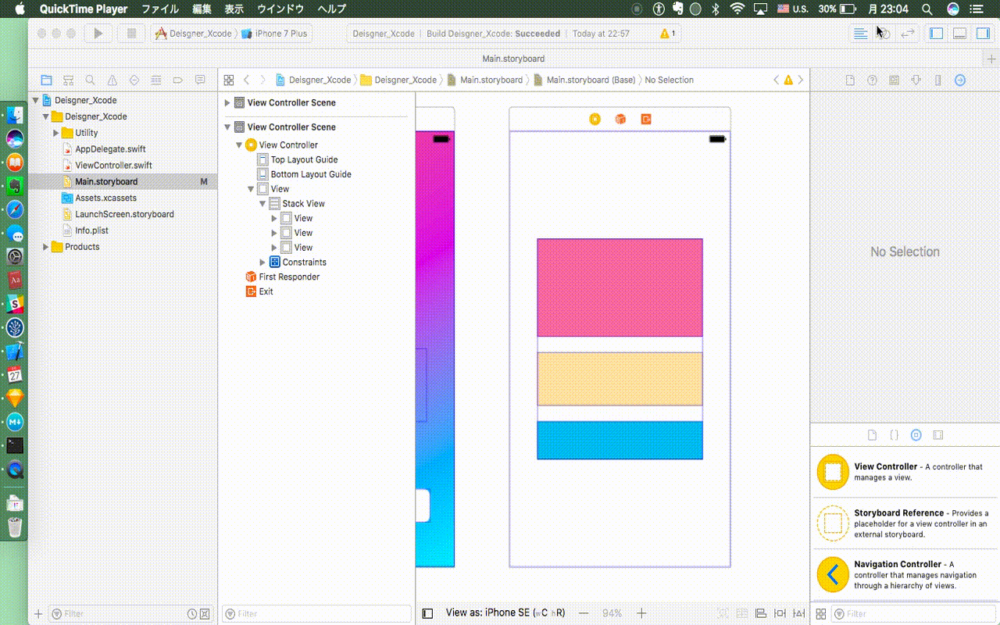
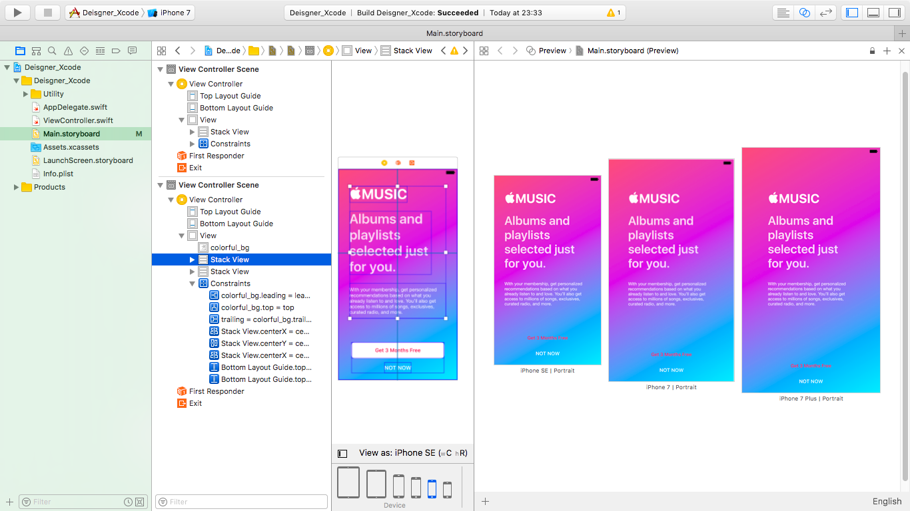
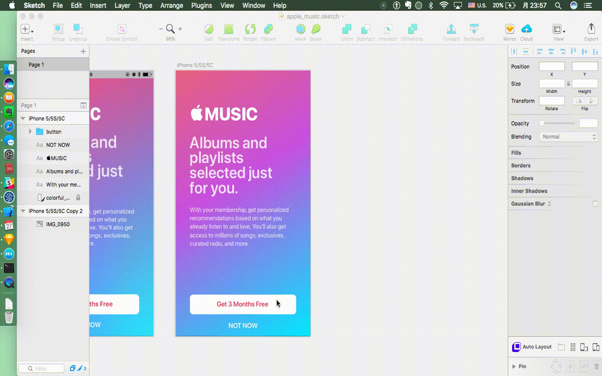
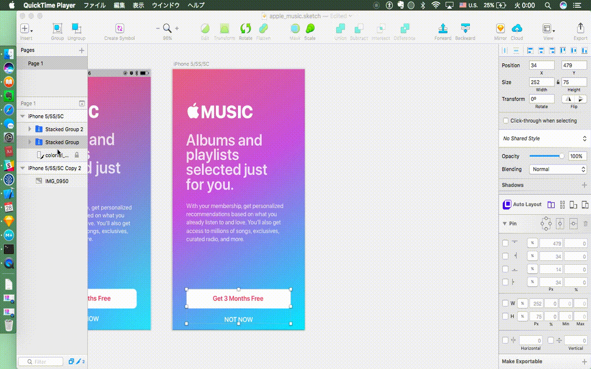
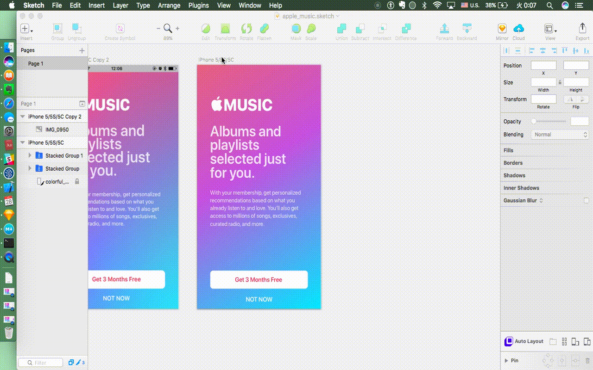

# Lesson 5. Let's play Autolayout

###[⬅️: Lesson 4](../Lesson_4/README.md)

概要: ますます増えているデバイスはどう対応するか？ Autolayoutはこの問題を解決する。

Step 1. まず、`StackView`を紹介したいと思う。CSSを勉強したことがある方は[`Flexbox`](https://css-tricks.com/snippets/css/a-guide-to-flexbox/)はきっと聞いたことがある。`StackView`と`Flexbox`はほどんと同じだ。

[このプロジェクト](starter)を開く、以下のgifのようにやってみよう。(gif中のXcodeバージョンは8.2)

Step 2. Viewを`StackView`に入れるだけのはどう配置するかまだわからない。Viewと`StackView`に制限(constraints)をつける必要がある。

Step 3. 各デバイスでの様子を見たい場合。

Step 4. Apple Musicのstoryboard同じ方法でやってみよう。結果は[このプロジェクト](final)を参考してください。

Step 5. Autolayoutは全部理解する、そして使いこなすのは若干難しい。でも、Autolayoutはエンジニアに自分のデザインを説明する唯一の方法とも言える。

幸いにAutolayoutの理念を理解したら、[Sketch](https://www.sketchapp.com)を利用して、Autolayoutを再現することができる。

[Auto Layout for Sketch](https://animaapp.github.io)というpluginをインストールすることが必要だ。

使い方はXcode StoryboardのAutolayoutより、はるかに使いやすい。

[このSketch](resources/starter)を開く、以下のgifのようにやってみよう。

まずは、`StackView`を作ろう。

次は、制限(constraints)をつけよう。

最後、各デバイスでの様子を見よう。

